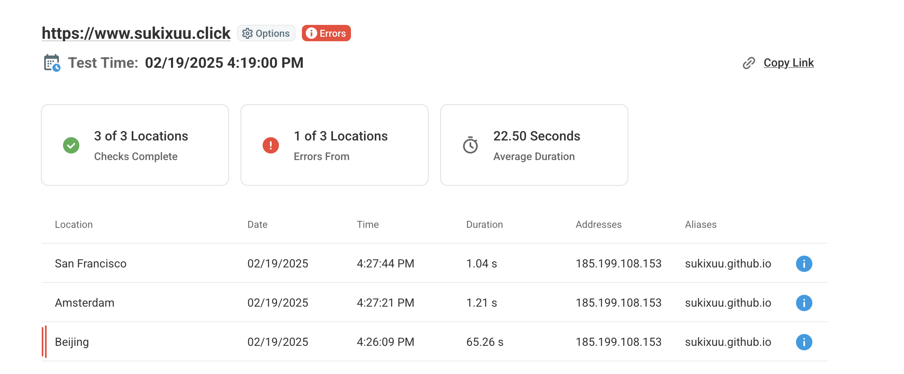
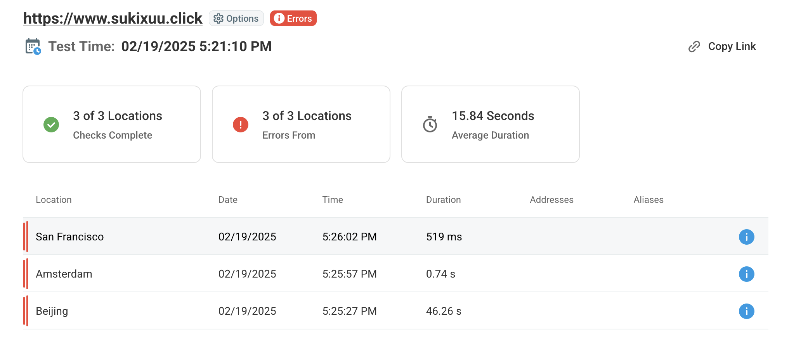
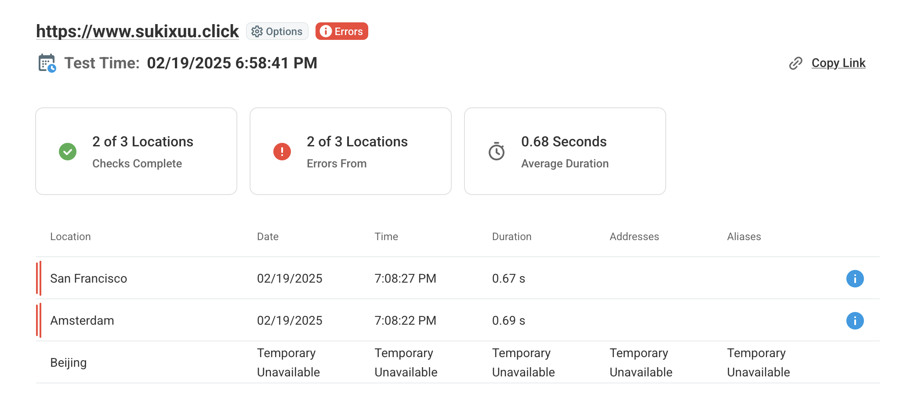
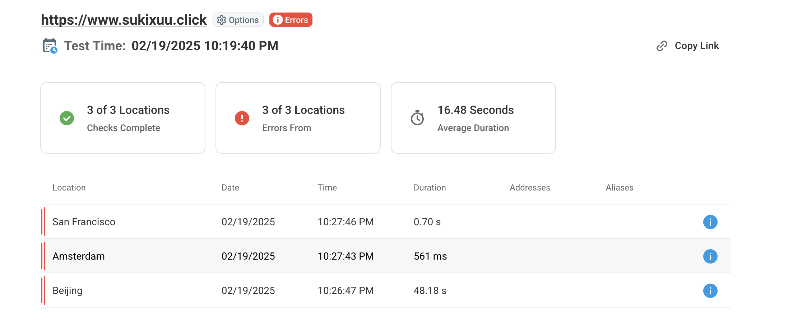

使用AWS CDN加速github pages个人网站。

<!--more-->
## 1. 构建后还是使用Github Pages，只使用AWS CloudFront创建 CDN 分发
CDN Content Delivery Network（内容分发网络）是一种基于网络的服务，它利用各地的服务器之间互联互通的特性，通过在用户访问网站时自动选择最佳的服务器提供内容，提高网站的访问速度。

AWS 的 CDN 服务叫做 CloudFront

### 测试访问速度
[dotcom DNS测试网站](https://www.dotcom-tools.com/dns-trace-test)



### 配置AWS CloudFront
1. 为个人域名申请一个公有证书：
	- 登录 AWS 管理控制台，选择 `Certificate Manager` -> `Request a certificate`
	- 输入您的域名，选择 `DNS validation` 方法，然后点击 `Next`
	- 创建一个域名Record，添加生成的CNAME记录，进行验证. 
		**注意原本域名上的CNAME记录需要删除，不然会导致验证失败;关联来自 AWS Certificate Manager 的证书。证书必须位于美国东部(弗吉尼亚北部)区域(us-east-1)。**
2. 创建一个新的 CloudFront 分配
3. Origin domain -- 输入您的 Github Pages 仓库的**域名**，如：`https://sukixuu.github.io`
4. 备用域名(CNAME) –- 添加您的域名，如：`sukixuu.click` (可选, 需要申请公有证书)




### 让 Github Actions 在每次有文件更改后自动初始化 CloudFront
1. 在工作流中添加一个 `AWS CLI` 任务，安装最新版本的 AWS CLI
	```yml
	- name: Set up AWS CLI
      uses: aws-actions/configure-aws-credentials@v1
      with:
        aws-access-key-id: ${{ secrets.AWS_ACCESS_KEY_ID }}
        aws-secret-access-key: ${{ secrets.AWS_SECRET_ACCESS_KEY }}
        aws-region: 'us-east-1'  # 替换为您所在的 AWS 区域
	```
      - 在AWS IAM中创建用户，并赋予其 `AmazonCloudFrontFullAccess` 和 `AmazonS3FullAccess` 权限。
      - 对此用户申请 Access Key 和 Secret Key。
      - 在GitHub Secrets中 **repository secrets** 添加 `AWS_ACCESS_KEY_ID` 和 `AWS_SECRET_ACCESS_KEY`，并将其设置为您的 IAM 用户的 Access Key 和 Secret Key。

2. 在工作流中添加一个 `AWS CloudFront` 任务，用于初始化 CloudFront
	```yml
    - name: Invalidate CloudFront Cache
      run: |
        aws cloudfront create-invalidation \
          --distribution-id YOUR_CLOUDFRONT_DIST_ID \ # 替换为您的 CloudFront 分配 ID
          --paths "/*" # 可以指定需要刷新的文件路径，这里全部刷新
	```




---
## 2. 构建后使用AWS S3 + AWS CloudFront
### 创建一个 S3 存储桶，用于存储静态网站
1. 登录 AWS 管理控制台，选择 `S3` -> `Buckets` -> `Create bucket`
2. 创建存储桶，且命名为域名（如：`sukixuu.click`）, 设置为公开访问。
3. 在属性中，启用`Static website hosting`
4. (可选) 子域：创建与子域名称相同的存储桶，并将其设置为公开访问。在`Static website hosting`中选`redirect` 并输入主域名，使用的是http协议。

### 配置 AWS CloudFront
1. 创建一个新的 CloudFront 分配，并选择相对应的 S3 存储桶作为源站。
2. 备用域名(CNAME) –- 添加您的域名，如：`sukixuu.click` (可选, 需要申请公有证书)

### 构建静态网站
将网站源码构建成静态文件，并且上传到AWS S3存储桶中。这里用 Github Actions 完成
1. 在工作流中添加一个 `AWS CLI` 任务，安装最新版本的 AWS CLI（同上）
2. 在工作流中添加一个 `AWS S3` 任务，用于构建网站源码并上传到 S3 存储桶中。（在deploy中，替换掉deploy到Github Pages的步骤）
	```yml
      # 上传构建后的文件到 S3
      - name: Deploy to S3
        run: |
          aws s3 sync ./public/ s3://sukixuu.click/ --delete
	```
3. 让 Github Actions 在每次有文件更改后自动初始化 CloudFront （同上）




---


